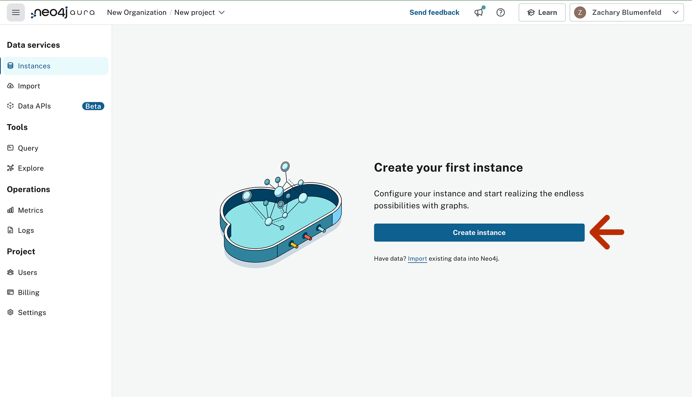
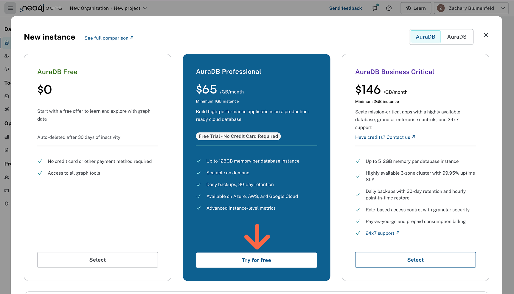
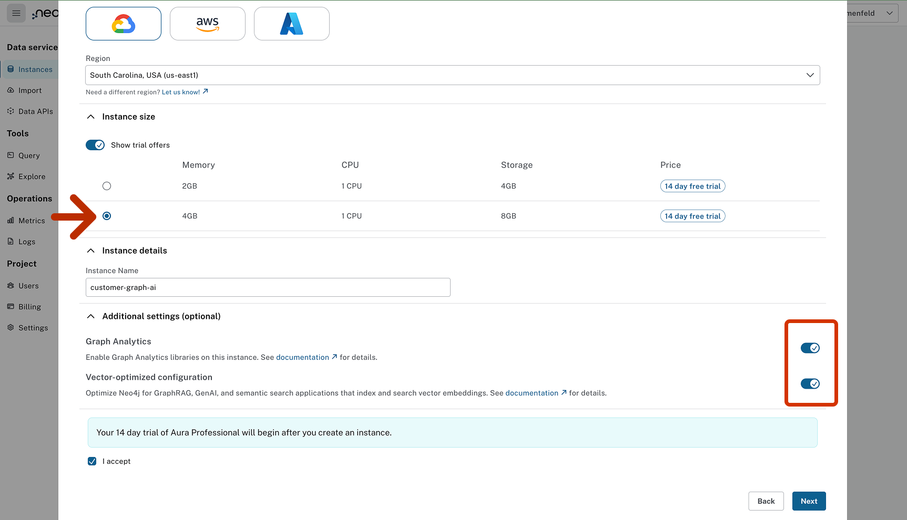
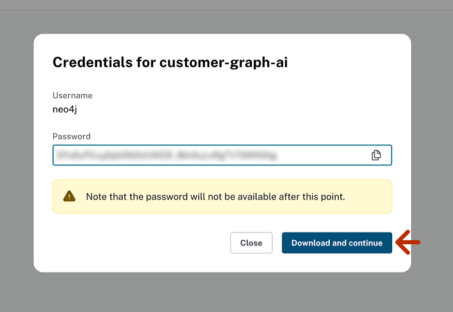

# AuraDB Trial Setup for Vectors & Graph Analytics

Quickly start a free Neo4j cloud DB with everything you need for running the AI & graph analytics examples in this repo. Just follow these steps!

1. Go to [console.neo4j.io](https://console.neo4j.io/) and login or set up an account.

2. Select the create instance button

3. Select "Try for Free" under Aura Professional.

4. Give your instance a reasonable name. select 4GB of memory and turn on the toggles for both Graph Analytics & Vector-Optimized Configuration. 

5. Click next and download the credentials.  You will need these for later. 

And that is it! It may take a couple minutes for the instance to spin up completely. 

If you have already used your free trial, you can continue with paid AuraDB Pro or, to continue for free, setup Neo4j community edition with Graph Data Science using the server or docker configurations described [here](https://neo4j.com/docs/graph-data-science/current/installation). You will need to host remotely for these examples to work well, such as on a separate compute instance on your cloud provider of choice. 

