# Customer Graph - Agentic GraphRAG

This directory contains an **end-to-end worked example for building a GraphRAG agent to accelerate customer and retail analytics**. Covering the entire process from:

1. **Quickly constructing a graph from mixed unstructured and structured data sources**.
2. **Resolving and linking entities** in the graph along the way.
3. **Creating diverse graph retrieval tools**, including query templates, vector search, dynamic text2Cypher, and graph community detection to answer a boarder range of questions.
4. **Building an agent** with Semantic Kernel for conducting analytics and responding to complex user questions. 

All of this using a central **source-of-truth graph schema** to govern the process and AI-interactions, ensuring higher data & retrieval quality. 


This workflow can be adapted for **analytics, reporting, and Q&A** across various other business domains—especially when:
- Data sources include a **mix of structured and unstructured** data
- AI needs to navigate a non-trivial **business domain model** for accurate responses
- The use case requires **flexibility** and the ability to scale to **complex, evolving** AI-driven tasks. 

Follow the instructions below to try it yourself! 🚀

## Setup

### Neo4j DB & OpenAI
1. Create a Neo4j DB instance per the direction [here](../AURA_SETUP_WITH_GA.md).

2. Have an OpenAI key ready. The costs should be minimal for this example. If you do not have one already you can create an [OpenAI account](https://platform.openai.com/signup) or [sign in](https://platform.openai.com/login). Navigate to the [API key page](https://platform.openai.com/account/api-keys) and "Create new secret key". Optionally naming the key. Save this somewhere safe, and do not share it with anyone.

3. Create .env file by copying .env.template: `cp .env.template .env`. Replace the Neo4j credentials and OpenAI key with your ow from above.

### Configure Python Env
Create and activate a new python virtual environment.
```bash
python -m venv graphrag_venv
source graphrag_venv/bin/activate
```
install requirements (from root directory of this repository)

```bash
pip install -r requirements.txt
```

## Create the Graph from Source Data
Creating the graph requires ingesting unstructured and structured data. You will use schemas in the [ontos](./ontos) folder to power them.  For more information on how these schemas were generated from a central source, see the __Schema Generation__ section.

The source data is a sample of the [H&M Personalized Fashion Recommendations Dataset](https://www.kaggle.com/competitions/h-and-m-personalized-fashion-recommendations/data), real customer purchase data that includes rich information around products including names, types, descriptions. We used ChatGPT to further augment this data - simulating suppliers for the different articles and CreditNotes for returns/refunds. The [data](data) folder contains the resulting structured data (in csvs) & unstructured data in the form of [credit-notes.pdf](data/credit-notes.pdf) representing the return/refund data. 

> **NOTE:** Please follow the steps in order below, going out of order may result in some conflicting deduplication and indexing issues. 

### 1) Load Unstructured Data
Run the unstructured ingest. This will take a few minutes.
```bash
python unstuctured_ingest.py
```
This script perform entity extraction on the [credit-notes.pdf](data/credit-notes.pdf) file and write entities and relationships to the graph according to the customer schema.

Once complete, you can check the database to see the generated graph. Go to the [Aura Console](https://console.neo4j.io/) and navigate to the Query tab.

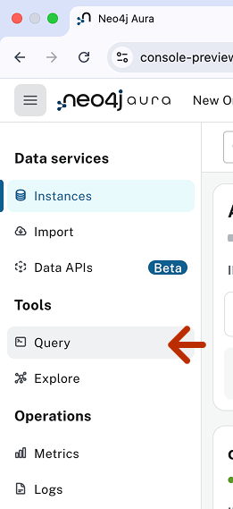

Select the "Connect instance" button
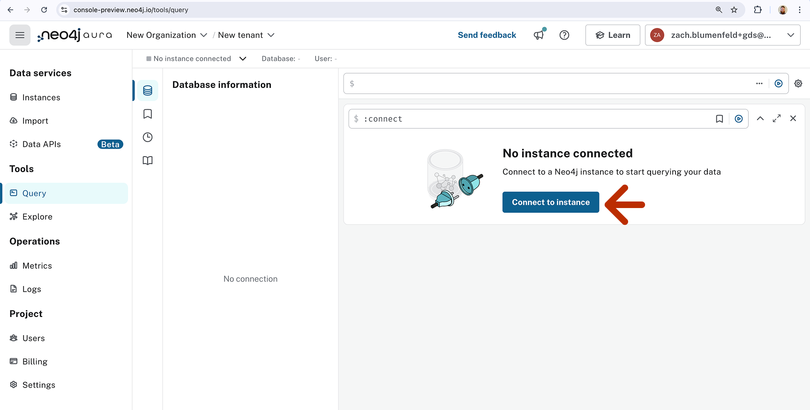

You will be prompted to select your Aura instance. Select the one you made for this project and enter your credentials:
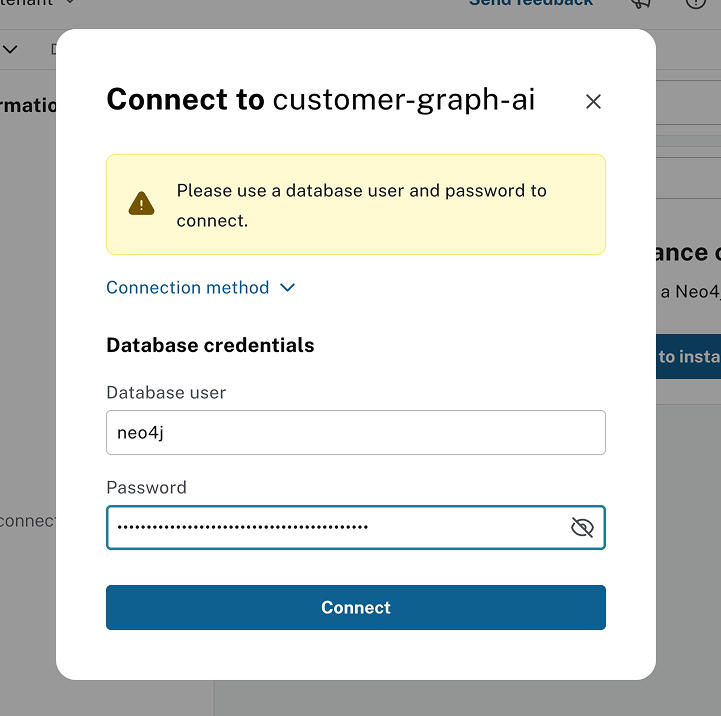

Once in the query tab you should see nodes and relationships in the sidebar that include CreditNode, Order, Article, Document & Chunk.
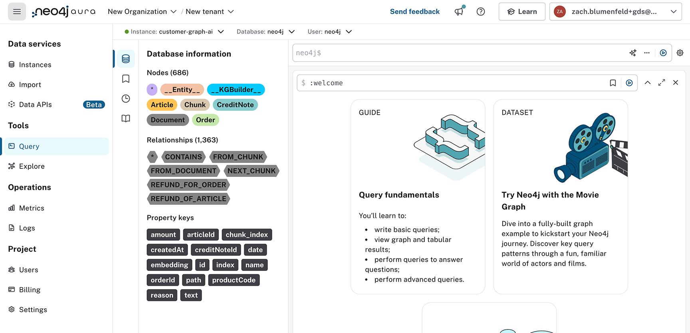

Run the following simple Cypher Query to see a sample of the data and explore.
```cypher
MATCH p=()--() RETURN p LIMIT 1000
```

You should see clear relationships between Orders, CreditNotes, and Articles as well as their connection back to source Chunks (a.k.a. document text chunks) and the single Document node with metadata about where they came from.
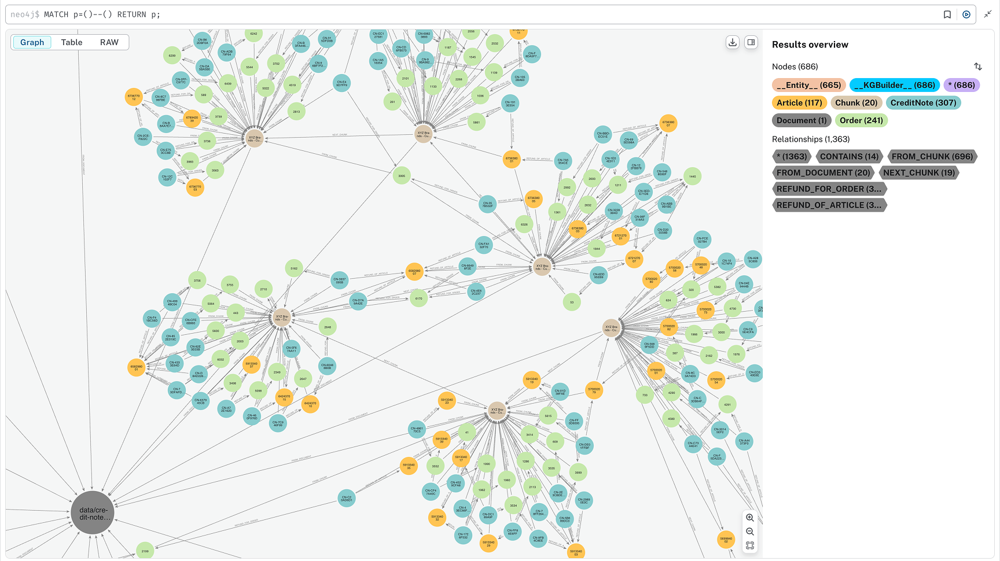


### 2) Merge Structured Data
We will use Aura Importer for this which allows you to map structured data from csvs or other relational databases to graph. 

Go to the [Aura Console](https://console.neo4j.io/) and navigate to the Import tab

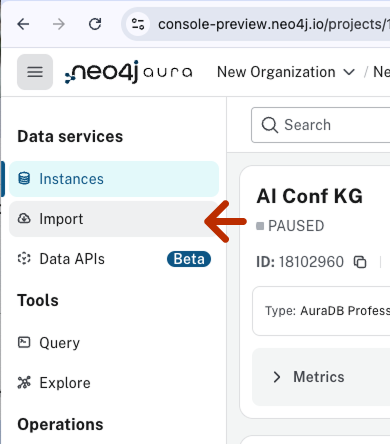

Select the ellipsis in the top left corner and then select "Open Model" in the dropdown
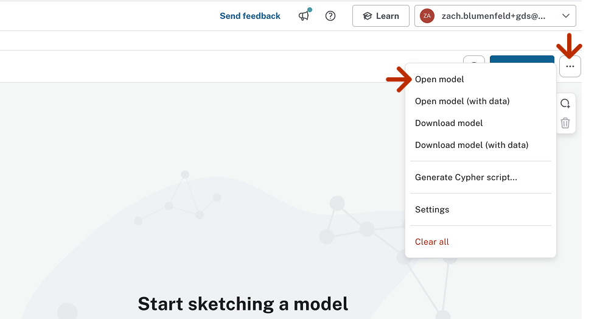

Choose [customer-struct-import.json](ontos/customer-struct-import.json) in the ontos folder. The resulting data model should look like the below:
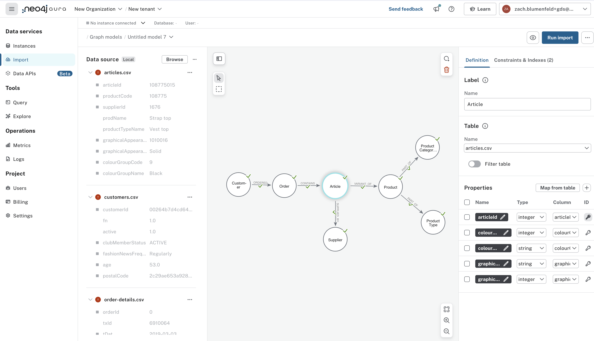

Now you need to select data sources.  Aura Im port allows you to import from several types of databases, but for today we will use local csvs. Select browse at the top of the Data source panel.
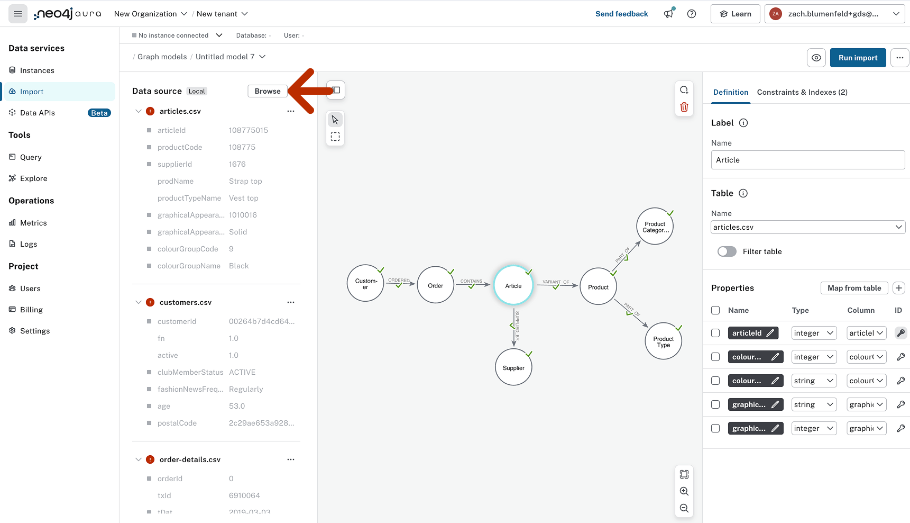

Select all the csv files in the [data](data) directory. Once complete you should see green check marks on each node and relationship.  When selecting a node you should also see the mapping between node properties and columns in the csvs.
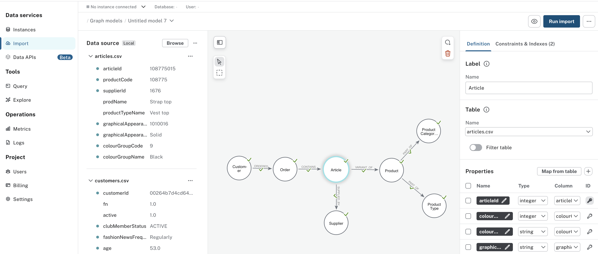

We are now ready to run the import.  Select the blue "Run import" button on the top left of the screen.  You will be prompted to select your Aura instance - select the one you made for this project and enter your credentials:
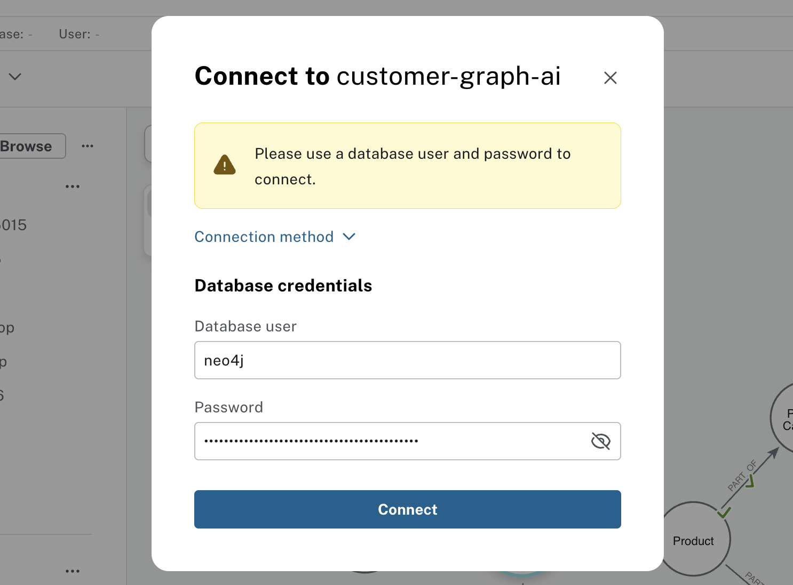

The import should only take a few seconds. Once complete, you should get an Import results pop-up with a "completed successfully" message and some statistics.
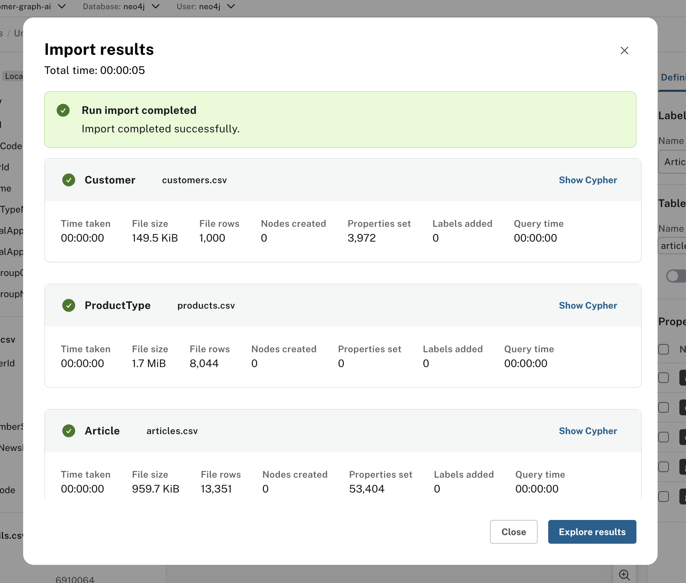

### 3) Post-Processing Script
The post-processing script is responsible for creating text properties, embeddings and a vector index to power search on Product nodes.  It takes a few minutes run as we need to call OpenAI embedding endpoint in batches to retrieve text embeddings.
```bash
python ingest_post_processing.py
```

Once complete go back to query in the Aura console. and run a simple query to sample the graph like the below:
```cypher
MATCH p=()--() RETURN p LIMIT 1000
```
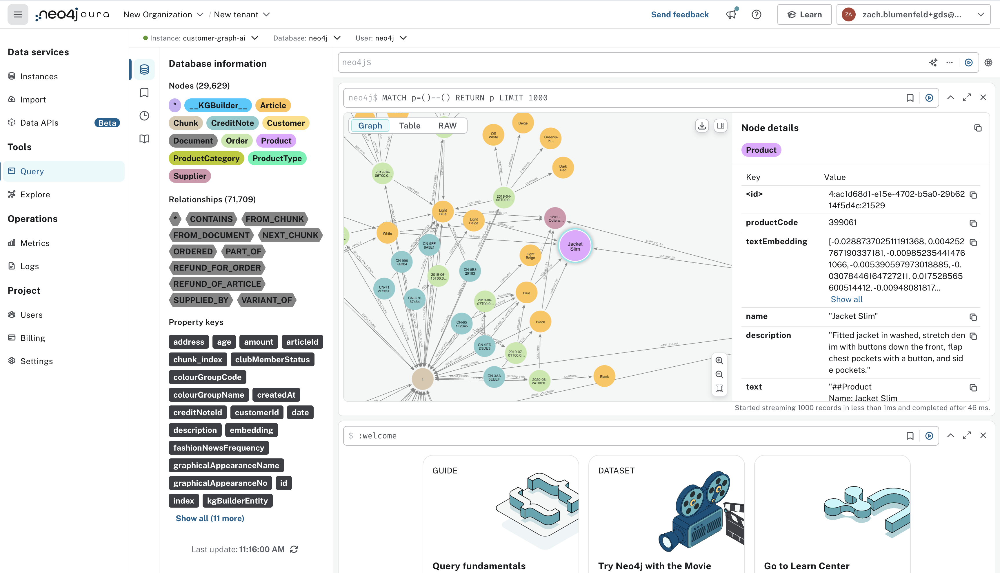

you should now see the unstructured data, the structured data, and product text/vector properties merged together on one graph!. 


## Running the Agent
Currently, the best way to run the agent is through the command line tool `cli_agent.py`. The streamlit app `app.py` is a WIP and still has some issues with hanging for multi Q&A conversations. 

To run, navigate to the graphrag folder and run the file:

```bash
cd graphrag
python cli_agent.py
```
Some sample questions to try
- What are some good sweaters for spring?  Nothing too warm please!
- Which suppliers have the highest number of returns (i.,e, credit notes)?
- What are the top 3 most returned products for supplier 1616? Get those product codes and find other suppliers who have less returns for each product I can use instead.
- Can you run a customer segmentation analysis?
- What are the most common product types purchased for each segment?
- Can you run a customer segmentation analysis? For the largest group make a creative spring promotional campaign for them highlighting recommended products.  Draft it as an email.


> ⚠️ Note: Agentic AI is still an evolving technology and may not always behave as expected out-of-the-box. For example, agents might choose different tools than intended, resulting in errors or bad responses.
This project provides a minimal agentic example, focusing on GraphRAG enhancement and integration, not on building a fully robust agentic system.
To add more stability and formalization to agent behavior using Semantic Kernel, see their [docs](https://learn.microsoft.com/en-us/semantic-kernel/).
For a GraphRAG example with deterministic tools & retrieval queries (instead of agents) on a similar dataset, see [AI for Customers Experience](https://neo4j.com/developer/genai-ecosystem/ai-for-customer-experiences/)

## Schema Generation
The single-source graph schema is [customer.ttl](ontos/customer.ttl). It was built in [webprotege](https://webprotege.stanford.edu/) and exported in turtle (ttl) format. The other schemas in the ontos directory are just derivatives of this one and described in more detail below. 

Per the process described in @jbarrasa's GoingMeta series [S2 episode 5](https://www.youtube.com/live/0c3WicsmLuo), this schema was transformed into a json format to be uploaded into Aura Import. The source code for that is [here](https://github.com/jbarrasa/goingmeta/tree/main/session32/python).  The schema was adjusted in Aura Import to produce [customer-struct-import.json](ontos/customer-struct-import.json) for the structured ingest.  The adjustments include adding the csv property mapping and excluding some nodes that aren't needed in the structured ingest. 

The unstructured ingest (`unstructured_ingest.py`) uses the source ttl schema directly to inform the entity extraction and graph writing process. If you look in the [customer.ttl](ontos/customer.ttl) file you will see "comment" annotations for some classes and properties. These are passed to the LLM to better describe the data schema and improve the entity extraction data quality.   


The final schema in the ontos directory is [text-to-cypher.json](ontos/text-to-cypher.json) and it is used by the graphrag application for text2Cypher query generation - specifically in [retial_service.py](graphrag/retial_service.py).  It was generated by running the following query against the database:

```cypher
CALL apoc.meta.stats() YIELD relTypes 
WITH  KEYS(relTypes) as relTypes 
UNWIND relTypes as rel
WITH rel, split(split(rel, '[:')[1],']') as relationship
WITH rel, relationship[0] as relationship
CALL apoc.cypher.run("MATCH p = " + rel + " RETURN p LIMIT 10", {})
YIELD value
WITH relationship as relationshipType, nodes(value.p) as nodes, apoc.any.properties(nodes(value.p)[0]) as startNodeProps, apoc.any.properties(nodes(value.p)[-1]) as endNodeProps
WITH DISTINCT labels(nodes[0]) as startNodeLabels, relationshipType, labels(nodes[-1]) as endNodeLabels,  KEYS(startNodeProps) as startNodeProps,  KEYS(endNodeProps) as endNodeProps
WITH startNodeLabels, relationshipType, endNodeLabels, COLLECT(endNodeProps) as endNodeProps, COLLECT(startNodeProps) as startNodeProps
WITH startNodeLabels, relationshipType, endNodeLabels, apoc.coll.toSet(apoc.coll.flatten(endNodeProps)) as endNodeProps, apoc.coll.toSet(apoc.coll.flatten(startNodeProps)) as startNodeProps
RETURN COLLECT({source:{label:startNodeLabels , properties:startNodeProps}, relationship:relationshipType, target:{label:endNodeLabels , properties:endNodeProps}}) as schema
```


